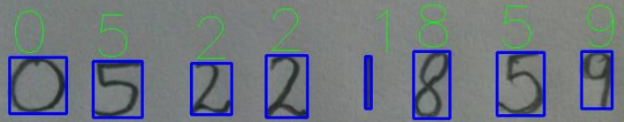
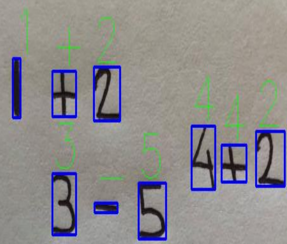
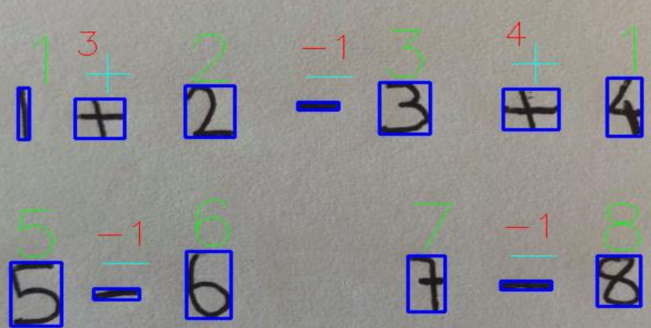

<h1 align="center">NN used to recognize numbers and basic operations
</h1>

<!-- Status -->

<!-- <h4 align="center">
	🚧  NN-used-to-recognize-numbers-and-basic-operations
 🚀 Under construction...  🚧
</h4>

<hr> -->

<p align="center">
  <a href="#dart-about">About</a> &#xa0; | &#xa0; 
  <a href="#sparkles-features">Features</a> &#xa0; | &#xa0;
  <a href="#rocket-technologies">Technologies</a> &#xa0; | &#xa0;
  <!-- <a href="#white_check_mark-requirements">Requirements</a> &#xa0; | &#xa0; -->
  <!-- <a href="#checkered_flag-starting">Starting</a> &#xa0; | &#xa0;
  <a href="#memo-license">License</a> &#xa0; | &#xa0;
  <a href="https://github.com/DussanFreire" target="_blank">Author</a> -->
</p>

<br>

## :dart: About

This project allows, through a PC camera, to recognize numbers and perform operations between them, in addition, it shows the result graphically.

## :sparkles: Features

:heavy_check_mark: Recognize numbers

<p align="center">
  
</p>

:heavy_check_mark: Recognize operations

<p align="center">
  
</p>

:heavy_check_mark: Perform operation

<p align="center">
  
</p>

## :rocket: Technologies

The following tools were used in this project:

- [Python](https://www.python.org/)
- [cv2](https://pypi.org/project/opencv-python/)
- [Anaconda](https://www.anaconda.com/products/individual)

<!-- ## :white_check_mark: Requirements

Before starting :checkered_flag:, you need to have [Git](https://git-scm.com) and [Node](https://nodejs.org/en/) installed.

## :checkered_flag: Starting

```bash
# Clone this project
$ git clone https://github.com/DussanFreire/NN-used-to-recognize-numbers-and-basic-operations


# Access
$ cd NN-used-to-recognize-numbers-and-basic-operations


# Install dependencies
$ yarn

# Run the project
$ yarn start

# The server will initialize in the <http://localhost:3000>
```

## :memo: License

This project is under license from MIT. For more details, see the [LICENSE](LICENSE.md) file.

Made with :heart: by <a href="https://github.com/DussanFreire" target="_blank">{{YOUR_NAME}}</a>

&#xa0; -->

<a href="#top">Back to top</a>
